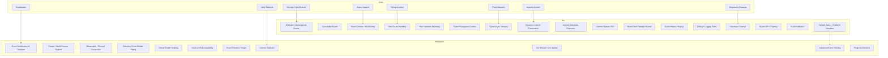

```mermaid
graph TD
    subgraph Core
        A1["Strongly-Typed Events"]
        A2["Event Streams"]
        A3["Async Support"]
        A4["Listener Control"]
        A5["Piping & onAny"]
        A6["Serialization"]
        A7["Utility Methods"]
        A8["Disposal & Cleanup"]
    end

    subgraph Pro
        B1["Wildcard / Namespaced Events"]
        B2["Cancelable Events"]
        B3["Event Context / this Binding"]
        B4["Error Event Handling"]
        B5["Max Listeners Warnings"]
        B6["Event Propagation Control"]
        B7["Typed Async Streams"]
        B8["Dynamic Listener Prioritization"]
        B9["Listener Metadata Exposure"]
        B10["Listener Names / IDs"]
        B11["Batch Emit / Multiple Events"]
        B12["Event History / Replay"]
        B13["Debug / Logging Tools"]
        B14["Automatic Cleanup"]
        B15["Fluent API / Chaining"]
        B16["Event Validation"]
        B17["Default Values / Fallback Handlers"]
    end

    subgraph Enterprise
        C1["Event Serialization & Transport"]
        C2["Cluster / Multi-Process Support"]
        C3["Observable / Promise Conversion"]
        C4["Selective Cross-Emitter Piping"]
        C5["Global Event Throttling"]
        C6["Node.js API Compatibility"]
        C7["Event Timeline / Graph"]
        C8["Listener Statistics"]
        C9["Hot Reload / Live Update"]
        C10["Advanced Event Filtering"]
        C11["Plugin Architecture"]
    end

    A1 --> B1
    A2 --> B7
    A3 --> B3
    A4 --> B8
    A5 --> B4
    A6 --> C1
    A7 --> C8
    A8 --> B14
    B17 --> C10

```
